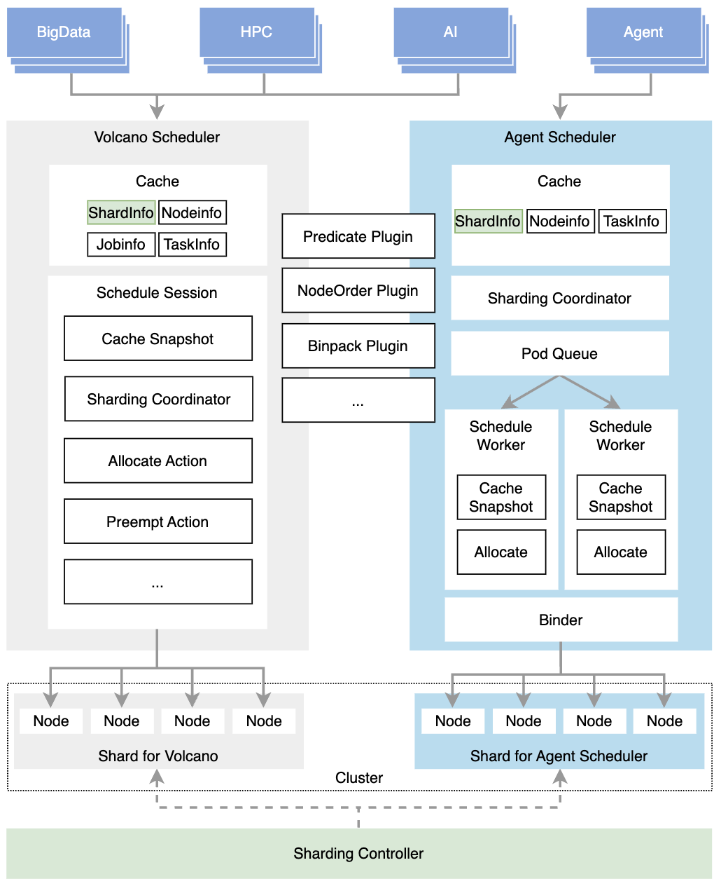
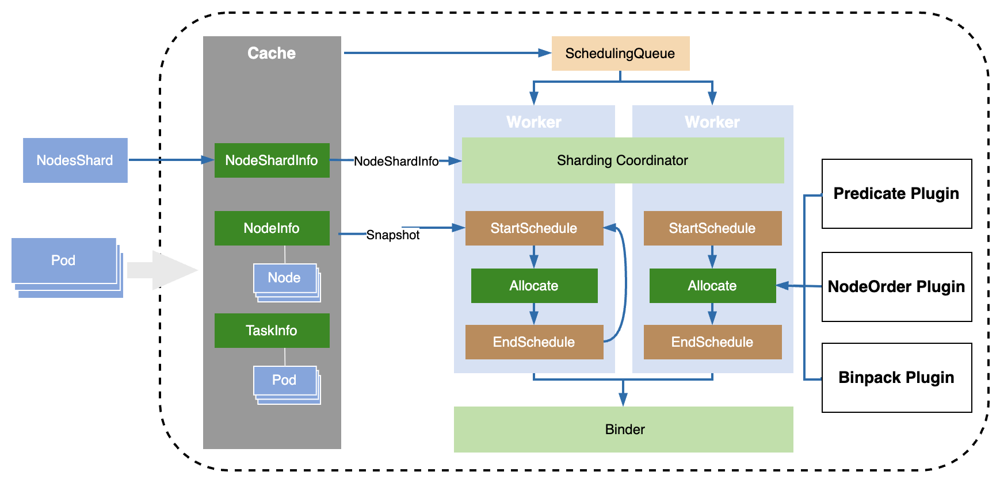

# Agent Scheduler

## Desgin Overview
Design purpose and Architecture overview.

### Problem
The Volcano Scheduler is designed and optimized for various batch and elastic workloads for Big Data, HPC, ML, and AI frameworks, providing high-performance scheduling and advanced scheduling strategies and algorithms. But Not all workloads require batch-scheduling characteristics. Instead, these workloads have scheduling requirements in other aspects which can not be satisfied in Volcano scheduler. Take AI Agent workloads as example:
1. Agent workload are latency-sensitive and involve frequent task creation. The scheduler must handle a large volume of tasks with ultra-fast scheduling, ensuring high throughput while keeping per-task scheduling latency low. When Agent workloads are deployed alongside other workloads in same cluster, the latency also need to be guaranteed. However, workloads in the Volcano scheduler are processed in batch mode at fixed intervals within each scheduling session. The Pod is not be able to scheduled immediatelly. When other workloads are present, workloads have to be scheduled in order, scheduling latency can not be guaranteed.
2. The Scheduling stractegy for Agent might be different from other workloads. Agent workloads may not require topology spread or pod affinity. Instead, they can be scheduled onto nodes with smaller or fragmented resources to better utilize resource fragments and improve overall cluster efficiency. It requeire different scheduling stractegy configured for different workload

### Design Goal

1. A scheduler capable of rapidly scheduling a large number of Pods.
Improve scheduling efficiency through workflow optimization and strategy simplification。

2. A scheduler that can collaborate with the Volcano scheduler to handle different types of workloads.
Enable collaboration and resource management between schedulers through shard-based parallel scheduling.

### Architecture Overview
An independent Agent scheduler is introduced to identify and make fast scheduling for Agent workloads. The scheduler improves the scheduling rate of individual Pods through optimized scheduling strategies and in-time Pod scheduling. It further increases overall scheduling throughput by leveraging parallel scheduling with multiple workers.

When Agent workloads coexist with other workloads, the sharding controller dynamicall divides nodes into shards based on defined policies like resource threshhold, node type, etc. Each scheduler obtains schedulable nodes through shard synchronization and selects or prioritizes the corresponding nodes for scheduling. This enables multiple schedulers to perform parallel scheduling of different workloads based on different shards. Refer to the [sharding controller design and shard strategy](shard-controller.md) for details.   

**Sharding Controller:** Dynamically assigns cluster nodes to different shards based on cluster nodes resource status and sharding strategy.

**Agent Fast-Path Scheduler:** Agent scheduler performs fast scheduling for Pods within the corresponding shard ( or with prioritization). It uses concurrent scheduling(multi workers) to increase task throughput and optimizes scheduling flow and strategy to improve scheduling efficiency.

**Volcano Scheduler:** Supports collaborative scheduling with the Agent scheduler for different types of workloads. Sharding coordinator is introduced to synchronize nodes from NodeShard. Once shceduling with shard is enabled, Volcano Scheduler schedule Pods within the corresponding shard ( or with prioritization).

## Schedule framework
Design of the scheduling workflow, scheduling queue, Plugin and Action mechanism.

### Scheduler architecture

### Component Relationship and Initialization

The system architecture relies on a strict hierarchy and initialization sequence

#### Hierarchy
- **Scheduler**: The top-level component that manages the lifecycle of the entire scheduling system. It owns the Cache, Configurations, and the Worker Pool.
- **Worker**: A concurrent scheduling unit. Each worker is independent and contains its own Framework instance. 
Multiple workers will simultaneously retrieve pods from the central scheduling queue for scheduling, employing optimistic parallel scheduling.
- **Framework**: The runtime environment for plugins within a worker. It holds a registry of plugins and actions, and crucially, maintains a **Snapshot** of the cluster state specific to that worker's current scheduling cycle.
- **Snapshot**: A point-in-time view of the cluster state (Nodes, Pods, etc.) derived from the global Cache. Each worker updates its snapshot at the beginning of a scheduling cycle to ensure consistency.
- **Action**: Defines the high-level scheduling logic (e.g., Allocate). Actions orchestrate the execution of multiple Plugins in a defined sequence.
- **Plugin**: Implements specific scheduling algorithms (e.g., Predicates, NodeOrder). Plugins are registered within the Framework and invoked by Actions.

#### Initialization Sequence

The initialization process begins with the **Scheduler**, which first establishes the global **Cache** to synchronize with the Kubernetes API server. 
It then loads the scheduling configuration to determine the active Actions and Plugins. Following this, the Scheduler initializes the **Worker Pool**. 
For each **Worker** spawned, a distinct **Framework** instance is created. At runtime, when a worker begins a scheduling cycle, 
it first updates its Framework's **Snapshot** from the global cache, providing a consistent view for the subsequent Action and Plugin execution.

### Scheduling Queue

#### Acknowledgments
The design of the scheduling queue is heavily inspired by and directly references the mature queue architecture of [kube-scheduler](https://github.com/kubernetes/kubernetes/tree/release-1.34/pkg/scheduler/backend/queue). We extend our sincere gratitude to the kube-scheduler contributors for their excellent work. As the design goals of the Volcano fast-path scheduler align closely with the principles behind kube-scheduler's queue management, we have chosen to build upon this proven architecture to rapidly establish a robust and efficient scheduling framework for agent workloads.

#### Queue Architecture
The scheduling queue manages the execution order of pods and consists of three components: **activeQ**, **backoffQ**, and **unschedulable pods pool**.

- **ActiveQ**: Stores pods that are ready for immediate scheduling.
- **BackoffQ**: Stores pods that have failed scheduling but are waiting for a backoff period to expire.
- **Unschedulable Pods Pool**: Stores pods that have failed scheduling and are determined to be unschedulable under current cluster conditions.

The workflow is as follows:

1. When new unscheduled pending pods are watched, they are added to the **activeQ**, the pods will be popped from the **activeQ** and tried to be scheduled.
2. If scheduling fails for the pod, it will be added to the **unschedulable pods pool**.
3. When cluster events occur (such as node updates, pod deletions, etc.), the scheduler checks pods in the **unschedulable pods pool**, if the event makes a pod potentially schedulable, the pod is moved to either **backoffQ** or **activeQ**, depending on whether it is still within its backoff period.

## Snapshot maintenance
Design of snapshot fast update mechanism and why. 

## Multi-Worker scheduling
Single scheduling process has performance bottleneck when a large number of Pods need to be scheduled. To improve throughput of scheduling, multple worker can be enabled to perform parallel scheduling. 
Parallel scheduling may bring scheduling confilct when cluster lack of resource. So Binder component is involved to resolve the confilct before executing real binding.

Workers pops Pods from the scheduling queue and perform scheduling. After predicates and node ordering, multiple candidate nodes (configurable in number) is stored in scheduling result for allocating. The scheduling results are then passed to the Binder for final binding. The Binder processes allocation results from multiple workers, using optimistic concurrency control to resolve scheduling confilct, executing Bind for non-conflicting results:

1. Each scheduling result records more than one allocatable nodes (number is configurable), with binding version recorded in each node at the time of allocation.

2. The Binder checks the node in the scheduling result sequentially. If the binding version in node has not been used in  previous Bind on that node, the Binder executes Bind on that node and update binging version of this node. 

3. If a bind version has already been used in a previous Bind for same node, the Binder checks the next available node in the allocation result.

4. If none of the nodes in the result are available, the Pod is push back to the scheduling queue in high priority for re-scheduling.

## Sharding synchronization
Design of shard synchronization flow.

## Configuration
Configuration details

